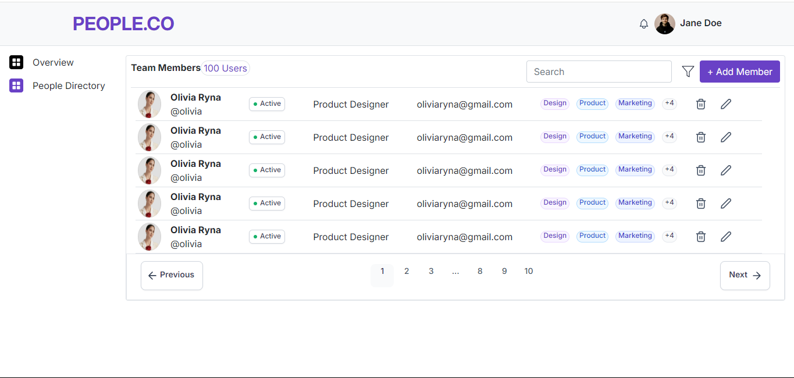

# People.co Home Page

This repository contains the code for the People.co home page, designed using Bootstrap. The design was taken from Figma and implemented with a combination of Bootstrap's flex utilities and some inline CSS.

## Project Overview

The People.co home page is a responsive web page designed to replicate the layout and style from a Figma design. The implementation leverages Bootstrap for responsive grid and flexbox layout, along with custom inline CSS for specific styling requirements.

## Features

- **Responsive Design:** Built with Bootstrap to ensure compatibility across various devices and screen sizes.
- **Flexbox Layout:** Utilizes Bootstrap's flex utilities to create flexible and dynamic layouts.
- **Custom Styling:** Some inline CSS is used to meet specific design requirements.

## Technologies Used

- **Bootstrap 5**
- **HTML5**
- **CSS3**
- **Figma** (Design Reference)

## How to Use

1. **Clone the repository:**
   ```bash
   git clone https://github.com/Nikita-developer38/peopleCo_website


## Output

Here is a preview of the People.co home page:



